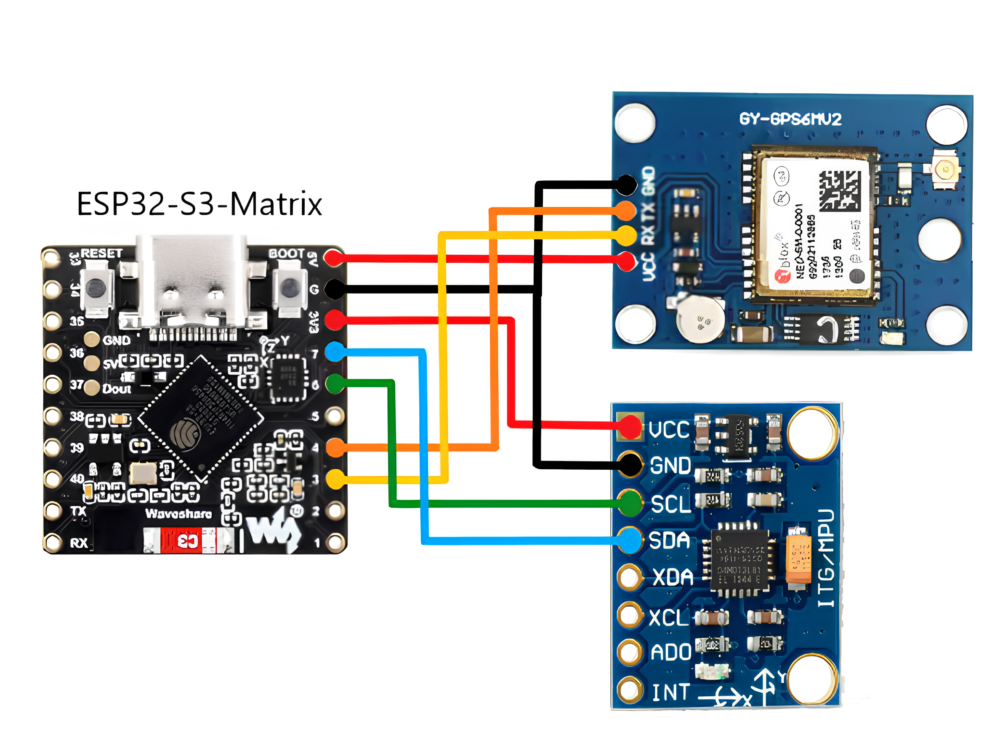
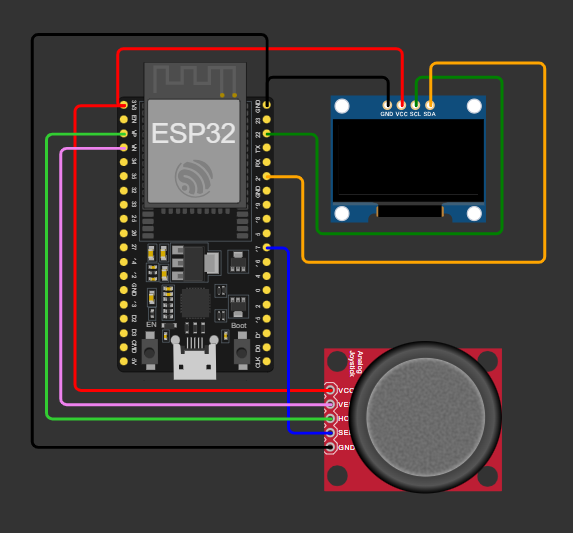

  

# 🌤 ESP-NOW MeteoStation v1 — First version

Перша версія моєї DIY метеостанції на базі ESP32-S3 та ESP32-WROOM-32 з використанням **ESP-NOW** для бездротової передачі даних.  
Збирає та відправляє температуру, GPS-координати та інші сенсорні дані на приймальний модуль.

---

## 📌 Функції
- 📡 Передача даних через ESP-NOW (без Wi-Fi мережі)
- 🌡 Вимірювання температури та вологості
- 📍 GPS-локація (широта, довгота, висота, швидкість)
- 🖥 OLED-дисплей для відображення показників
- ⏱ Підрахунок кількості отриманих пакетів

---

## ⚙ Технічні деталі
- **MCU:** ESP32-S3 та ESP32-WROOM-32
- **Дисплей:** SSD1306 (128×64)
- **GPS:** модуль з підтримкою TinyGPS++
- **Датчики:** MPU6050 (акселерометр, гіроскоп) + температурний сенсор
- **Протокол:** ESP-NOW

---

## 📚 Використані бібліотеки
- Adafruit Unified Sensor
- Adafruit MPU6050
- TinyGPS++
- Adafruit SSD1306

---

## 🔌 Схеми підключення

Тут зібрані усі електричні та принципові схеми для проєкту **ESP-NOW Weather Station v1**.

---

### 1️⃣ Схема підключення ESP32-S3 + GPS + MPU6050

  
*Особиста розробка, виконана у графічному редакторі.*

---

### 2️⃣ Схема ESP32 + OLED + Джойстик

  

VRX_PIN - 39
VRY_PIN - 36
BUT_PIN - 17

*Схема створена у [Wokwi](https://wokwi.com/).

---

© 2025 Vlad Bovsunivskij
